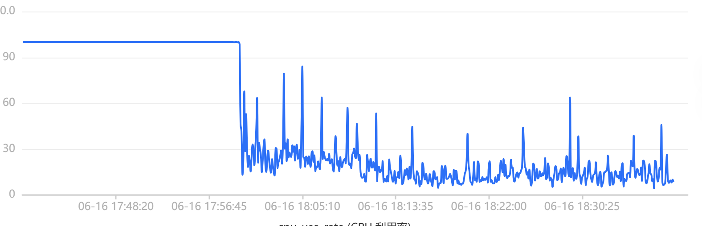

Early one evening, a new client institution started mass-uploading files. The uploads went through RocketMQ to an upload-processing consumer, and that consumer went unresponsive. Messages backed up, the team's chat lit up, and the consumer was for all practical purposes dead.

I didn't debug it by hand. I pointed Claude Code (Opus 4.8) at the cluster and let it run the investigation autonomously: `kubectl exec` into the pods, `jstack` the JVMs, `jstat` the GC state, report back. My own working hypothesis at that moment was the obvious one, that threads were starving on some resource and waiting for something that never came.

The agent came back with a confident answer: a thread leak in our cloud vendor's object-storage SDK, thousands of `IdleConnectionMonitorThread` daemons never reclaimed. It fingered this as the root cause, and I acted on it. I doubled the pods to stop the bleeding, had a colleague drain the backed-up queue, and asked the customer to re-upload later.

It didn't work. Other teams' systems kept failing, and the database's CPU stayed pegged at 100%. That symptom, the one that refused to die no matter what I did to the consumer, is what eventually dragged my attention to a MySQL CPU alert that had been firing the entire time. The real culprit was three hops away, in a query I had never looked at, against a table the unresponsive consumer didn't even own.

This post is about that misdirection. A thread dump, a profiler, a dashboard, and an AI agent all answer the same question extremely well: *what is the system mostly doing?* An incident's true culprit is almost never the thing the system is mostly doing. It's the binding constraint. And there's a bookend I have to put up front, because it's the honest core of the whole thing: the unindexed query that caused the outage was AI-generated. I'd had Claude Code write that data-access code, it was functionally correct, it passed tests, it ran fine on a small dev table. So the same AI both *wrote* the bug and later *misdiagnosed* it. I own both.

---

## TL;DR

1. A new institution started mass-uploading files. The path was RocketMQ to an upload consumer, and the consumer went unresponsive. My first instinct, and the agent's, was thread starvation.
2. I let Claude Code run `jstack` autonomously. The biggest bucket in the dump: **1,347 of 1,912 threads were a leaked object-storage daemon** (`IdleConnectionMonitorThread`). The agent called it the root cause. It was a real bug, with no causal connection to this incident.
3. I acted on that wrong answer: doubled the pods, drained the queue, deferred the customer. Doubling pods backfired, because more consumers triggered more downstream work against an already-saturated shared database. The bleeding didn't stop, and other teams' systems kept failing.
4. The real culprit: a separate summarization service, triggered by the same upload pipeline, ran an unindexed full-table scan against a **shared** MySQL instance. It **examined 1,171,955 rows to return 1**, took 223 seconds per query, and pegged the instance's CPU at 100%. CPU is shared across the whole instance, so every other system on that database, even ones with perfectly indexed queries, got starved.
5. The discriminator: **"how many systems are affected?"** (more than one points at a shared resource) and **"what change restored service?"** (the answer was the index, not fixing the thread leak). Bookend: the offending query was AI-written, so the same AI wrote the bug and then misdiagnosed it.

---

## The Misdirection: jstack the Loudest Box

The upload consumer was the loudest thing in the room. It was unresponsive, it was the system everyone was talking about, and it was trivially reachable for a thread dump. When a service goes dark and you can `jstack` it in one command, that's where attention goes, naturally and wrongly.

The first thing the autonomous investigation taught me is a meta-lesson about diagnostic tooling: the tool you reach for fails exactly when you need it most. The old instance, the one that had been running for 4 days 23 hours and was deepest into the incident, would not produce a thread dump at all. `jstack` hung for over 31 minutes without emitting a single line and had to be killed. The mechanism is worth knowing: `jstack` attaches to the JVM and needs every thread to reach a safepoint before it can enumerate stacks, and a JVM thrashing under native-memory pressure with thousands of threads can take many minutes to bring them all to one. We were forced to fall back to a fresher, healthier instance (33 minutes of uptime) to get a dump out at all. The sickest patient was the one we couldn't examine.

Here's the dump that came back from that 33-minute-old instance:

| | |
|---|---|
| Total threads | 1,912 |
| `TIMED_WAITING` | 1,665 (87%) |
| Anonymous `Thread-*` | 1,349 |
| ⤷ of which `IdleConnectionMonitorThread` | **1,347** |

And the one stack fragment that mattered:

```
"Thread-50" #587 [585] daemon prio=5 os_prio=0 cpu=26.90ms elapsed=1987.55s
   java.lang.Thread.State: TIMED_WAITING (on object monitor)
        at java.lang.Object.wait0(java.base@21.0.10/Native Method)
        at java.lang.Object.wait(java.base@21.0.10/Object.java:366)
        at com.cloudvendor.storage.http.IdleConnectionMonitorThread.run(IdleConnectionMonitorThread.java:48)
        - locked <0x00000007fe8ec870> (a com.cloudvendor.storage.http.IdleConnectionMonitorThread)
```

Read this dump the way a triage instinct wants to read it. Eighty-seven percent of threads are in `TIMED_WAITING`. The single largest bucket, nearly all of the anonymous threads, is a leaked object-storage daemon. The surface story writes itself: the service is wedged because it's drowning in threads, and the threads are leaking, so the leak is what wedged the service. It is a seductive wrong answer, and both the agent and I bought it.

## The Tell: Idle Daemons Don't Block Consumption

A screen full of `WAITING` threads has two completely different possible meanings, and conflating them is the trap.

The first is **contention**: a bounded number of worker threads all blocked on the *same* shared resource. You'd see a pool of identically-named threads parked on one monitor, the signature of N workers fighting over a lock or a connection. That story is consistent with "the service is wedged waiting for something."

The second is a **leak**: a large number of *independent* threads, each parked on its own monitor, that should never have existed. That's what this dump was. The 1,347 leaked entries were each `locked` on their own distinct `IdleConnectionMonitorThread` instance. They weren't contending over anything shared. They were unrelated leftovers, accumulating.

The decisive point isn't even the leak-versus-contention distinction. It's what these threads *are*. An `IdleConnectionMonitorThread` is a housekeeping daemon: it wakes every few seconds, sweeps idle HTTP connections, and goes back to `Object.wait()`. It does nothing in the request path. It consumes native memory, one stack each, and at scale over days that can absolutely kill an instance, but it does not participate in message processing. It cannot be the acute cause of a minute-scale "the consumer is unresponsive *right now*" event. Idle daemons don't block consumption; they just sit there being idle.

The numbers don't support "the leak did this," either. The fresh instance accumulated 1,347 of these in 33 minutes. The old instance had 3,402 threads in 4 days 23 hours. If the fresh instance's rate were the steady state, five days would have produced something like 290,000 threads, orders of magnitude past where it would have died. The fresh count is a burst-period snapshot, not a steady-state rate. There's even a self-limiting feedback here: once consumption stalls, the leak slows down too, because the code path that creates the clients runs less often. The leak is real, but in this incident it's a passenger, not the driver.

### The jstat Red Herring Inside the Red Herring

While we were anchored on the leak, `jstat -gcutil` on the dying old instance handed us a second misleading signal that seemed to corroborate the first:

| | |
|---|---|
| `M` (metaspace) | 98.18% |
| `CCS` (compressed class space) | 90.13% |
| `FGC` (full GC count) | 0 |
| `GCT` (total GC time, ~5 days uptime) | ~26 s |

Metaspace at 98% looks like an instance about to die of metaspace exhaustion. It is not, and two facts dismantle it.

First, `jstat`'s `M` column is `used / committed`, not `used / MaxMetaspaceSize`. It tells you how full the *currently committed* metaspace region is, not how close you are to the configured ceiling. This JVM did set `-XX:MaxMetaspaceSize=384m`, but `M = 98%` only says the slice committed so far is nearly full, which is the normal steady state, because the JVM commits metaspace lazily and keeps it tight. To know whether you're approaching the 384m wall, watch `MC` (committed capacity) and whether *it* is climbing toward 384m. An `M` reading of 95–99% is not by itself alarming.

Second, and decisively: `FGC = 0`. A JVM genuinely running out of its 384m metaspace budget triggers Full GCs trying to reclaim class metadata, and failing that throws `OutOfMemoryError: Metaspace`. This instance had triggered zero Full GCs across nearly five days, with a cumulative `GCT` of about 26 seconds. Metaspace was never under pressure. The 98% was `jstat` noise.

That leaves a question I'll pay off later: if metaspace, which *is* capped at 384m, was fine, then what region was actually being exhausted on the old instance as it accumulated 3,402 threads? Hold that thought.

## The Breakthrough: The Symptom That Refused to Die

The satisfying version of this story would be that some clever human stepped back, correlated across systems, and intuited a shared database. That's not what happened.

What happened is that my first aid didn't stop the bleeding. I'd doubled the pods, drained the queue, and asked the customer to re-upload, and afterward colleagues from *other* business systems were *still* reporting lag and errors. The consumer I'd been frantically treating wasn't the only thing broken, and nothing I did to it helped anything.

Worse, doubling the pods was the wrong move. The bottleneck wasn't the consumer's capacity, it was the shared MySQL instance's CPU. Each upload the consumer processes triggers the summarization service, and the summarization service is what runs the expensive query. So adding consumer pods didn't add throughput; it pushed more uploads through faster, which fired more summarization queries, which slammed a database that was already saturated. Scaling out a service whose real bottleneck is a shared downstream amplifies the root cause instead of relieving it. I'd taken the one action that made the binding constraint bind harder.

The symptom that refused to die is what finally turned me. Multiple unrelated teams failing at once, plus a CPU graph stuck flat at 100%, was a signal no amount of poking at one consumer could explain. That pulled me into the database monitoring, where I found the MySQL CPU alert that had been screaming the entire time. The blast radius wasn't a clue I cleverly discovered. It was a symptom that wouldn't go away and dragged me, late and against my own initial focus, to the actual culprit.

This is the human-versus-AI fork, and it isn't flattering to either side. The agent was deep inside a single JVM's thread dump and structurally could not see that *other* systems were also down, because that cross-system view simply isn't in a `jstack`. But I didn't look at the cross-system view either, not at first. I had to be forced into it by a failed remediation. Correlating across services is the thing a human is supposed to add, and I added it slower than I'd like to admit.

The framing that should have come faster: the loudest victim is rarely the culprit. The upload consumer was unresponsive because *its own* database calls, against that same shared instance, were timing out on a dying MySQL. It was a victim. The perpetrator was three hops away, a different application abusing a shared CPU.

## Root Cause: One Unindexed Query, 1.17 Million Rows, One Result

Here is the query at the bottom of it all, from the slow-query digest:

```sql
select ..., vendor, vendor_id, ...
from llm_invocation
where is_del = ? and (vendor = ? and vendor_id = ?)
limit ?
```

| Metric | Value | What it means |
|---|---|---|
| Database | the summarization service's own schema | Same **physical instance** as other systems; separate logical schema, **shared CPU** |
| Executions | 685 | Concurrency during the upload spike |
| Avg execution time | **223.1 s** (max 278.2 s) | A single SELECT running for nearly four minutes |
| Total time | 152,832 s | ~42 hours of cumulative CPU burned by this one statement |
| **Avg rows examined** | **1,171,955** | Full table scan |
| **Avg rows returned** | **1** | A 1,171,955 : 1 examined-to-returned ratio |
| Lock wait | **0** | Decisive: this is not lock contention or transaction starvation. It's pure CPU. |

Two columns do the diagnostic work. The first is `lock wait = 0`, which kills my original starvation hypothesis outright: nothing here was waiting on a lock. Whatever was wrong, it was burning CPU, not blocking on contention.

The second is the examined-to-returned ratio of 1,171,955 : 1. This, not the execution time, is the real tell. Execution time tells you a query is slow without telling you why. The examined-to-returned ratio is the autopsy report for a missing index: to return one row, MySQL read the entire table. The `limit ?` gives a false sense of safety, since `limit` caps the *output*, not the *work*. With no index on the `WHERE` predicate, finding that one matching row meant scanning nearly the whole table, every time, 685 times during the spike.

### Why a Shared MySQL Turns One Bad Query Into a Platform Outage

The mechanism by which one query takes down a platform is more insidious than the connection-exhaustion failure mode most people picture.

It wasn't that the query held connections or locks, since `lock wait` was zero. It was CPU saturation. A missing index means a full table scan means `rows_examined` scales with the size of the table, a CPU bomb. Multiply that by burst concurrency, 685 executions clustered in the spike, and `threads_running` climbs far past the instance's core count. Once `threads_running` exceeds the number of cores, MySQL spends an increasing share of its time scheduling rather than executing, and even a cheap, well-indexed query that examines three rows can't get a CPU slice. It queues behind the scans.

This is a noisy-neighbor problem on shared CPU, and it's why logical separation doesn't save you. The summarization service lived in its own logical schema. Didn't matter. A shared physical CPU is a shared failure domain. Every other system on that instance, each with its own well-behaved, indexed queries, degraded in lockstep, because they all drew from the same exhausted CPU pool. That is the entire blast radius: one application's unindexed query, and a CPU that everyone shares.

The CPU utilization graph from that evening tells the story with brutal economy. Before 17:57:00 the line is flat against 100%, the instance's CPU completely pegged, no ripple, no headroom. At 17:57 it falls off a cliff to a noisy 10–30%, the normal working range, and stays there. That flat ceiling is the physical proof that full-table scans had burned through the shared CPU. The cliff is "we changed one thing and the system recovered instantly," rendered as a chart.



## The Fix, and the Discriminator

```sql
-- turn the full-table scan into an index lookup
ALTER TABLE llm_invocation ADD INDEX idx_vendor_id (vendor, vendor_id, is_del);
```

`EXPLAIN ANALYZE` after the index existed:

```
-> Limit: 1 row(s)  (cost=1.07 rows=1) (actual time=0.179..0.179 rows=1 loops=1)
    -> Index lookup on llm_invocation using idx_vendor_id
       (vendor='<vendor>', vendor_id='<call_id>', is_del=0)
       (cost=1.07 rows=1) (actual time=0.178..0.178 rows=1 loops=1)
```

Put that next to the slow-query digest and you get the single hardest table in this post:

| | Before (no index) | After (`idx_vendor_id`) |
|---|---|---|
| Access method | full table scan (`type: ALL`) | index lookup |
| Rows examined | ~1,171,955 | **1** |
| Per-query time | ~223 s (avg) | **0.18 ms** |

That's roughly a 1.2-million-fold speedup, with rows examined falling from 1,171,955 to 1.

*(One honest caveat: we never captured a formal before-`EXPLAIN`. The index went on under incident pressure, with no time to record the broken plan first. The "before" numbers come from the slow-query digest, not a captured `EXPLAIN`.)*

Two things this fix earns the right to say.

The index didn't cure a slow query. It defused a bomb sitting on the shared CPU. When a single query collapses from examining 1.17 million rows to examining one, the CPU saturation breaks, the time-slice contention clears, and *everyone* recovers, not just the summarization service. Latency was the symptom; CPU was the contended resource. Fix the resource and the symptom disappears across every affected system at once. That's the 17:57 cliff.

The two halves of recovery map onto queuing theory. Draining the queue cut the *arrival rate*; adding the index cut the *service cost per query*. You need both. The LLM-summarization step has inherent latency no index can remove, so "ask the customer to re-upload later" was legitimate rate-limiting, not deflection. But draining the queue alone did not drop the CPU; only the index produced the cliff. First aid bought time, and the index was the cure. Which is the discriminator, and the one I'd tattoo on the next on-call engineer: you don't find the root cause by asking which bucket in the dump is biggest. You find it by asking what change actually restored service. We added an index and the platform recovered, so the binding constraint was the unindexed query. The 1,347 leaked threads, the biggest number we saw all night, were never on the causal path.

## The Chronic Bug We Found by Accident

The object-storage client thread leak is a real bug. Every `new ObjectStorageClient()` spins up an `IdleConnectionMonitorThread` daemon, and if you never call `shutdown()` that thread is never reclaimed. Over five days the old instance had quietly accumulated 3,402 threads this way, and it would have eventually died of it.

But it's a chronic condition we tripped over while investigating an acute one. The leak kills an instance over days; the incident killed the platform in minutes. They share nothing except being visible in the same dump. The fix is straightforward: reuse a single client, or if you genuinely need a transient instance, wrap it in `try/finally` and call `shutdown()`. (One caveat: with temporary credentials, a long-lived singleton needs a refreshable credentials provider rather than fixed credentials welded in at construction.)

The lesson is about diagnosis, not about object storage. Stumbling onto a real bug mid-investigation is good. Declaring it the root cause and going home is mistaking "happened to be at the scene" for "committed the crime."

### Which Memory Region Does a Thread Leak Actually Attack?

This is the most elegant thing the JVM flags handed us, and it pays off the loose end from the `jstat` section. Here's how the instance was launched:

```
-XX:InitialRAMPercentage=50.0 -XX:MaxRAMPercentage=70.0
-XX:MaxMetaspaceSize=384m -XX:MaxDirectMemorySize=256m
-XX:ReservedCodeCacheSize=128m -XX:+UseG1GC
(OpenJDK 21.0.10)
```

The team capped every region of memory they could think of: heap at 70% of RAM, metaspace at 384m, direct memory at 256m, code cache at 128m. Every region they could name, they bounded.

But thread stacks aren't in any of those budgets. Each thread gets roughly a 1 MB native stack, allocated from native memory that lives outside every one of those `-XX` flags. So a thread leak grows in precisely the one region nobody put a ceiling on. 3,402 threads is gigabytes of stack space growing unchecked, in the one place no flag bounds, until the container hits its memory limit and gets OOMKilled by Kubernetes, or the JVM gives up with `unable to create new native thread`.

That closes the `jstat` loop. Metaspace was capped at 384m and was never the problem; `FGC=0` proved it. The region actually being consumed was the uncapped one, native thread stacks. The metric that looked scary, metaspace at 98%, was bounded and safe. The danger was in a region no metric on our dashboard was even watching.

## Why the Investigation Went Wrong

The companion post in this series ends on why static review missed a latent bug. This one needs the same accounting, and this time both the human and the AI anchored, and the human acted on the anchor.

The core failure mode here is double anchoring. The upload consumer was the loudest victim, and the leaked daemons were the biggest number in the dump. Both answer "what is most prominent?" Both the agent and I nailed our attention to a single victim and a single unrelated bug, and then I made it worse by acting on it.

The agent's blind spot generalizes uncomfortably. It drilled deep into one machine's thread dump and structurally could not see that other systems were failing. The better an autonomous agent is at drilling into one signal, the easier it is for it to drill into the *wrong* signal. Its confidence is exactly as narrow as its field of view. But my own failure was a broken action-feedback loop: after I doubled the pods, the CPU graph didn't move, and that negative result should have immediately falsified the thread-leak hypothesis. A remediation that changes nothing is a loud signal you're treating the wrong thing.

And the bookend. The same AI wrote the offending query, functionally correct and test-passing and never validated for behavior at scale, and then misdiagnosed it during the incident. This isn't "AI is dumb, humans are smart." It's that AI review and human review share the same blind spot: both read code and reason about correctness, and neither sees runtime behavior at scale. The query was correct in every sense a reader can check. It was catastrophic in a sense only a running system under load can reveal. That's why the defenses below are runtime signals, not more careful reading. You cannot eyeball your way to an examined-to-returned ratio.

## Operational Checklist

For anyone who operates services that share a database, cache, or message broker, which is most of us:

1. **Ask "how many systems are affected?" before "which one is loudest?"** More than one independent system failing points at a shared resource, before any single victim's local state. The loudest service is usually downstream of the actual fault.
2. **Don't scale out a service before confirming its bottleneck is local.** Adding capacity to a service whose real constraint is a shared downstream multiplies load on that constraint instead of relieving it.
3. **Gate new query paths on `EXPLAIN type` and the `rows_examined / rows_sent` ratio before they ship to a shared database.** Make the check part of the change, not something you reconstruct from a slow-query digest after the outage.
4. **Alert on `threads_running` exceeding core count and on the `rows_examined / rows_sent` ratio**, not on connection count or raw slow-query count. Connection alerting points at the victim; the examined-to-returned ratio points at the culprit.
5. **Before writing the postmortem, ask what change restored service.** Whatever that change touched is your binding constraint.
6. **Read `jstat` correctly.** `M` and `CCS` are `used / committed`, so 95–99% is routine; judge metaspace danger by whether `MC` climbs toward `MaxMetaspaceSize`. And remember thread stacks live in native memory outside every `-XX` budget, so a thread leak attacks the one region you can't cap with a flag.
7. **While you're in there, audit every `new XxxClient()` for reuse and `shutdown()`.** Any client that starts a background thread is a leak candidate if it's constructed per-call and never closed.

---

*References:*
- Your cloud vendor's object-storage SDK documentation, on client lifecycle and `shutdown()` semantics (the leaking `IdleConnectionMonitorThread` is the connection-pool sweeper that a per-call client never stops).
- [MySQL Reference Manual — `EXPLAIN` output format](https://dev.mysql.com/doc/refman/8.0/en/explain-output.html) and [Server Status Variables](https://dev.mysql.com/doc/refman/8.0/en/server-status-variables.html) (`Threads_running`, `Rows_examined`).
- [HotSpot `jstat` reference](https://docs.oracle.com/en/java/javase/21/docs/specs/man/jstat.html) for the `-gcutil` column definitions (`M` and `CCS` are `used / committed`).
- Companion post: [*When Long-Stable Code Suddenly Starts Failing*](/p/latent-bug-threadlocal-pollution/), the same theme from the other direction, a defect born on day one and detonated later by scale and load.

---

*A note on desensitization: internal service names have been abstracted (the upload-processing consumer; a separate summarization service), and the cloud vendor's object-storage SDK is referred to generically, with the leaking class's package name anonymized. The table name is abstracted to `llm_invocation` (a ledger of the business's LLM calls), and the literal values of `vendor` / `vendor_id` are replaced with placeholders. The index name `idx_vendor_id` and generic column names (`is_del`, and so on) are industry-standard and kept as-is. The CPU graph carries no hostnames, instance IDs, or dashboard identifiers, only a generic `cpu_use_rate` metric and timestamps. The mechanism (shared-instance CPU saturation, a missing-index full-table scan, an agent's single-machine deep dive leading to a misdiagnosis) and the timeline (2026-06-16, recovery at 17:57) are accurate to what happened in production.*
